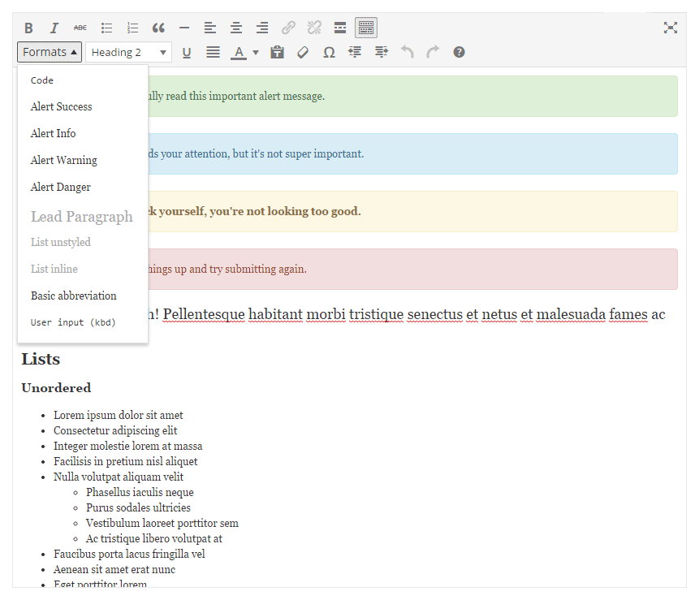

# Introduction #

This WordPress plugin adds new formats/styles to the WordPress Editor.

## How to disable the front-end style? ##

To remove the stylesheet from your WordPress site (front-end only), simply add the following constant to your  theme's `functions.php`:

    define( 'N2_CUSTOM_STYLES', false );

This allows you to define style from within your theme's stylesheet.

## CSS Classes & Selectors ##

If you want to create your own style, here are all the classes and selectors used:

* Code: code
* Basic abbreviation: abbr
* User input (kbd): kbd
* Alert Success: .alert .alert-success
* Alert Success: .alert .alert-info
* Alert Success: .alert .alert-warning
* Alert Success: .alert .alert-danger
* Lead Paragraph: .lead (p)
* List unstyled: .list-unstyled (ul, ol)
* List inline: .list-inline (ul, ol)